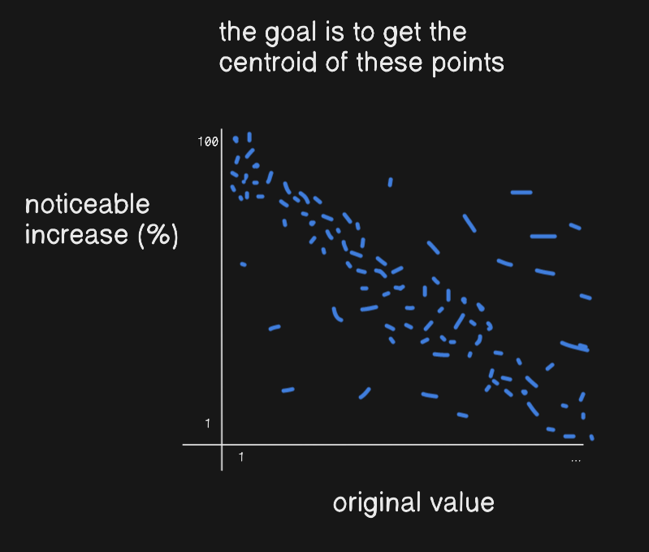

# Is 25 Perceivable?

a survey for checking if 25% increase in change is actually perceivable

#### Inspiration

If you have read Refactoring UI by Adam Wathan and Steve Schoger, you might have a question, why 25%? In "Establish a spacing and sizing system" section, the book suggest that for a change to be perceivable, it should be around 25%, in other words, it should either increase or decrease by around 25% of the original size. The book did not explain why around 25% specifically.

#### Goal

This app aims to gather data from internet users to get the average score, and tell if 25% is really the value we need.

#### How does it work?

It's simple, users just look at the design's initial size, then after x seconds, the design will be resized by a random percentage. Then their score would be sent to the database, to move the centroid.

#### But isn't perceivable change magnified by the original size?

Yes, that's correct. This is why a user's score is recorded with the element's original size as well. This way, we can see the perceivable change values for different element's original size.

#### Motivation

I don't expect this project to be a success, but I hope it does. I just thought of this as cool. I guess I just can't get over from my [previous project](https://github.com/dotRarufu/spacify) (related with this project)
